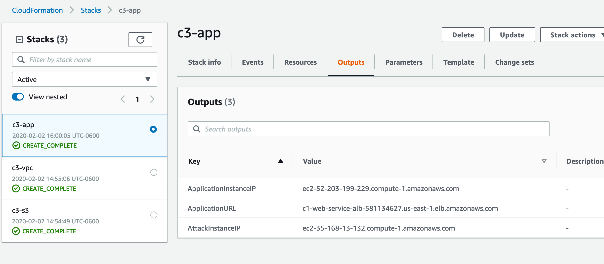
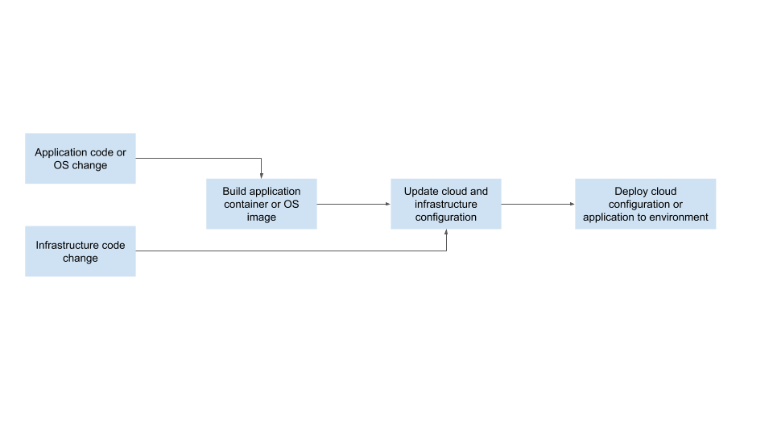

# Cloud Security - Secure the Recipe Vault Web Application
 
In this project, you will:
 
* Deploy and assess a simple web application environment’s security posture
* Test the security of the environment by simulating attack scenarios and exploiting cloud configuration vulnerabilities
* Implement monitoring to identify insecure configurations and malicious activity 
* Apply methods learned in the course to harden and secure the environment
* Design a DevSecOps pipeline
 
## **I. Deploy Project Environment**
### **1. Review Architecture Diagram** 

#### **Expected user flow:**
- Clients will invoke a public-facing web service to pull free recipes.  
- The web service is hosted by an HTTP load balancer listening on port 80.
- The web service is forwarding requests to the web application instance which listens on port 5000.
- The web application instance will use the public-facing AWS API to pull recipe files from the S3 bucket hosting free recipes. An IAM role and policy will provide the web app instance permissions required to access objects in the S3 bucket.
- Another S3 bucket is used as a vault to store secret recipes; there are privileged users who would need access to this bucket. The web application server does not need access to this bucket.
 
#### **Attack flow:**
- Scripts simulating an attack will be run from a separate instance which is in an un-trusted subnet.
- The scripts will attempt to break into the web application instance using the public IP and attempt to access data in the secret recipe S3 bucket.

#### **Poor security practices in Architecture Diagram above**
 - Security Group has port 80 open to the Internet but not use to communicate between web instance and ELB because it use port 5000. Then we should remove open port 80 rule on Security Group and limit the port 5000 only point to ELB security group.
 - We can redeploy it in a private subnet since only the load balancer within our VPC needs access. Thus far there has been no documented need for the web service to establish outbound connections, so we should eliminate the egress rule that allows access to the Internet on all ports from all protocols.
 - S3 buckets, including the bucket for VPC flow logs, have no server-side encryption enabled/files were uploaded without encryption and all the buckets have block public access disabled. Not encrypting the contents of the S3 buckets could allow people who shouldn't have access to the content to view the content within the buckets.
 - The S3 buckets do not follow the principle of least privilege. By default, all S3 buckets are private and can be accessed only by users that are explicitly granted access. When using AWS, it's best practice to restrict access to your resources to the people that absolutely need it.
 - Restrict access to your S3 buckets or objects by:                                                                 
    a) Writing AWS Identity and Access Management (IAM) user policies                                                 
    b) Writing bucket policies that define access to specific buckets and objects                                     
    c) Using Amazon S3 block public access as a centralized way to limit public access                                
    d) Setting access control list (ACLs) on your buckets and objects
 - APIs credentials should not be exposed directly because it can compromise sensitive data, cloud services, and cloud infraestructure.

### **2. Review CloudFormation Template**

Additionally, we have provided a CloudFormation template which will deploy the following resources in AWS:
 
#### **VPC Stack for the underlying network:**
* A VPC with 2 public subnets, one private subnet, and internet gateways etc for internet access.
 
#### **S3 bucket stack:**
* 2 S3 buckets that will contain data objects for the application.
 
#### **Application stack:**
* An EC2 instance that will act as an external attacker from which we will test the ability of our environment to handle threats
* An EC2 instance that will be running a simple web service.
* Application LoadBalancer
* Security groups
* IAM role
 
### **3. Deployment of Initial Infrastructure**
Deploy the CloudFormation stacks that will create the environment below

 
 
#### **Deploy the S3 buckets**
```bash
aws cloudformation create-stack --region us-east-1 --stack-name c3-s3 --template-body file://starter/c3-s3.yml
```
Expected example output:
```bash
{
    "StackId": "arn:aws:cloudformation:us-east-1:4363053XXXXXX:stack/c3-s3/70dfd370-2118-11ea-aea4-12d607a4fd1c"
}
```
#### **Deploy the VPC and Subnets**
```bash
aws cloudformation create-stack --region us-east-1 --stack-name c3-vpc --template-body file://starter/c3-vpc.yml
```
Expected example output:
```bash
{
    "StackId": "arn:aws:cloudformation:us-east-1:4363053XXXXXX:stack/c3-vpc/70dfd370-2118-11ea-aea4-12d607a4fd1c"
}
```
#### **Deploy the Application Stack** 
We will need to specify a pre-existing key-pair name.
```bash
aws cloudformation create-stack --region us-east-1 --stack-name c3-app --template-body file://starter/c3-app.yml --parameters ParameterKey=KeyPair,ParameterValue=<add your key pair name here> --capabilities CAPABILITY_IAM
```
Expected example output:
```bash
{
    "StackId": "arn:aws:cloudformation:us-east-1:4363053XXXXXX:stack/c3-app/70dfd370-2118-11ea-aea4-12d607a4fd1c"
}
```
Expected example AWS Console status: 
https://console.aws.amazon.com/cloudformation/home?region=us-east-1#/stacks


 
Obtain the name of the S3 bucket by navigating to the Outputs section of the stack:
 

 
We will need the bucket names to upload example recipe data to the buckets and to run the attack scripts. 
- We will need the Application Load Balancer endpoint to test the web service - ApplicationURL
- We will need the web application EC2 instance public IP address to simulate the attack - ApplicationInstanceIP
- We will need the public IP address of the attack instance from which to run the attack scripts - AttackInstanceIP
 

 
#### **Upload data to S3 buckets**
```bash
aws s3 cp free_recipe.txt s3://<BucketNameRecipesFree>/ --region us-east-1
aws s3 cp secret_recipe.txt s3://<BucketNameRecipesSecret>/ --region us-east-1
```
 
#### **4. Test the application**
Invoke the web service using the application load balancer URL:
```
http://<ApplicationURL>/free_recipe
```
You should receive a recipe for banana bread.

The AMIs specified in the cloud formation template exist in the us-east-1 (N. Virginia) region. You will need to set this as your default region when deploying resources for this project.

## **II. Enable Security Monitoring**
### **Enable Security Monitoring using AWS Native Tools**
#### **Enable AWS Config**
 a. See below screenshot for the initial settings.   
   
 b. On the Rules page, click **Skip**.  
 c. On the Review page, click **Confirm**.
#### **Enable AWS Security Hub**
 a. From the Security Hub landing page, click **Go To Security Hub**.  
 b. On the next page, click **Enable Security Hub**
#### **Enable AWS Inspector scan**
 a. From the Inspector service landing page, leave the defaults and click **Advanced**.  
   
 b. Uncheck **All Instances** and **Install Agents**.  
 c. Choose Name for Key and ‘Web Services Instance - C3’ for value, click **Next**.  
   
 d. Edit the rules packages as seen in the screenshot below.  
   
 e. Uncheck **Assessment Schedule**.  
 f. Set a duration of 15 minutes.
 g. Click **Next** and **Create**.
#### **Enable AWS Guard Duty**
After 1-2 hours, data will populate in these tools giving you a glimpse of security vulnerabilities in your environment.

### **Provide recommendations on how to remediate the vulnerabilities**
Attack Instance Security Group:
 - Security Groups allow ingress from 0.0.0.0/0 to port 22

WebApp Security Group:
 - Security groups allow ingress from 0.0.0.0/0 to port 22
 - Security groups allow ingress from 0.0.0.0/0 to port 3389

EC2 instance have a public IP address and not configured to use with Systems Manager.

S3 bucket doesn't have a lifecycle policy enabled.

We should put the instances behind ELB and move it into private subnet to remove the public IP addresses, configure instance to ssh with the Systems Manager and add a lifecycle policy to the S3 buckets.

Only keep the web services's inbound rules traffic from ELB security group.

We should fix these by removing SSH access to our instances, instead using immutable
instances; changing the default security group in our VPC to restrict all traffic; and 
removing the security group inbound and outbound rules that allow all traffic on all ports
from all protocols.

**Deliverables:** 
- **E2T2_config.png** - Screenshot of AWS Config showing non-compliant rules.
- **E2T2_inspector.png** - Screenshot of AWS Inspector showing scan results.
- **E2T2.png_securityhub.png** - Screenshot of AWS Security Hub showing compliance standards for CIS foundations.
 
## **III. Attack Simulation**
Making an SSH connection to the application server using brute force password cracking.
Capturing secret recipe files from the s3 bucket using stolen API keys.
 
### **1. Brute force attack to exploit SSH ports facing the internet and an insecure configuration on the server**
```bash
ssh -i <your private key file> ubuntu@<AttackInstanceIP>
# Run the below commands to start a brute force attack against the application server.  You will need the application server hostname for this.
date
hydra -l ubuntu -P rockyou.txt ssh://<YourApplicationServerDnsNameHere>
```
You should see output similar to the following:

Wait 10 - 15 minutes and check AWS Guard Duty.
 
**Deliverables:**
- **E3T1_guardduty.png** - Screenshot of Guard Duty findings specific to the Exercise 3, Task 1 attack.
 
### **2. Accessing Secret Recipe Data File from S3**
 
Imagine a scenario where API keys used by the application server to read data from S3 were discovered and stolen by the brute force attack. This provides the attack instance the same API privileges as the application instance. We can test this scenario by attempting to use the API to read data from the secrets S3 bucket.
 
#### Run the following API calls to view and download files from the secret recipes S3 bucket.
```bash
# view the files in the secret recipes bucket
aws s3 ls  s3://<BucketNameRecipesSecret>/ --region us-east-1
# download the files
aws s3 cp s3://<BucketNameRecipesSecret>/secret_recipe.txt . --region us-east-1
# view contents of the file
cat secret_recipe.txt
```
Choose one of the application vulnerability attacks outlined in the OWASP top 10 (e.g. SQL injection, cross-site scripting). 

    a. Attempt to invoke the application using the ALB URL with a corrupt or malicious URL payload.
    b. Setup the AWS WAF in front of the ALB URL.
    c. Repeat the malicious URL attempts
    d. Observe the WAF blocking these requests.

- **E3T2_s3breach.png** - Screenshot showing the resulting breach after the brute force attack.
## **IV. Implement Security Hardening**
### **1. Remediation plan**
- Adjusting the SG of Web Server instance to only allow SSH connections
with bastion host. Now an attacker would need to first gain access to the bastion
host to reach our Web Service, allowing us to focus our firewall and OS
hardening on the bastion host and reducing our attack surface.
- Restrict outbound rules on the EC2 instance. Allow ssh from a specific subnet or one 
IP to SSH the Web Server Instance
- Using immutable instances, prevent all SSH into EC2 instance.
- Turning off public access.
- Assign a bucket policy to secret bucket restricts read access to a SG group in VPC. 
This SG should only include actors who have the permission to access the secret recipe bucket.
- Enable server-side encryption for S3 bucket
### **2. Hardening**
#### **Remove SSH Vulnerability on the Application Instance**
1. To disable SSH password login on the application server instance.
```bash
# open the file /etc/ssh/sshd_config
sudo vi /etc/ssh/sshd_config
# Find this line:
PasswordAuthentication yes
# change it to:
PasswordAuthentication no
# save and exit
#restart SSH server
sudo service ssh restart
```
2. Test that this made a difference.  Run the brute force attack again from Exercise 3, Task 1.  

3. Take a screenshot of the terminal window where you ran the attack highlighting the remediation and name it E4T2_sshbruteforce.png.

**Deliverables:**
- **E4T2_sshbruteforce.png** - Screenshot of terminal window showing the brute force attack and the remediation.

#### Apply Network Controls to Restrict Application Server Traffic

1. Update the security group which is assigned to the web application instance.  The requirement is that we only allow connections to port 5000 from the public subnet where the application load balancer resides.
2. Test that the change worked by attempting to make an SSH connection to the web application instance using its public URL.
3. Submit a screenshot of the security group change and your SSH attempt.

**Deliverables**:
- **E4T2_networksg.png** - Screenshot of the security group change. 
- **E4T2_sshattempt.png** - Screenshot of your SSH attempt.

#### Least Privilege Access to S3  

1. Update the IAM policy for the instance profile role used by the web application instance to only allow read access to the free recipes S3 bucket.
2. Test the change by using the attack instance to attempt to copy the secret recipes.
3. Submit a screenshot of the updated IAM policy and the attempt to copy the files. 

**Deliverables:**
- **E4T2_s3iampolicy.png** - Screenshot of the updated IAM policy.
- **E4T2_s3copy.png** - Screenshot of the failed copy attempt.

#### Apply Default Server-side Encryption to the S3 Bucket

This will cause the S3 service to encrypt any objects that are stored going forward by default.
Use the below guide to enable this on both S3 buckets.   
[Amazon S3 Default Encryption for S3 Buckets](https://docs.aws.amazon.com/AmazonS3/latest/dev/bucket-encryption.html)

Capture the screenshot of the secret recipes bucket showing that default encryption has been enabled.

**Deliverables**:
- **E4T2_s3encryption.png** - Screenshot of the S3 bucket policy.

### **3. Check Monitoring Tools to see if the Changes that were made have Reduced the Number of Findings**

1. Go to AWS inspector and run the inspector scan that was run in Exercise 2.
2. After 20-30 mins - check Security Hub to see if the finding count reduced.
3. Check AWS Config rules to see if any of the rules are now in compliance.
4. Submit screenshots of Inspector, Security Hub, and AWS Config titled E4T3_inspector.png, E4T3_securityhub.png, and E4T3_config.png respectively.

**Deliverables**:
- **E4T3_securityhub.png** - Screenshot of Security Hub after reevaluating the number of findings.
- **E4T3_config.png** - Screenshot of Config after reevaluating the number of findings.
- **E4T3_inspector.png** - Screenshot of Inspector after reevaluating the number of findings.

### **4. Questions and Analysis**

1. What additional architectural change can be made to reduce the internet-facing attack surface of the web application instance.
2. Assuming the IAM permissions for the S3 bucket are still insecure, would creating VPC private endpoints for S3 prevent the unauthorized access to the secrets bucket.
3. Will applying default encryption setting to the s3 buckets encrypt the data that already exists?
4. The changes you made above were done through the console or CLI; describe the outcome if the original cloud formation templates are applied to this environment?

Submit your answers in E4T4.txt.

**Deliverables**:
- **E4T4.txt** - Answers from prompts in Exercise 4, Task 4.

###  _Optional Standout Suggestion_ **5 - Additional Hardening**

Make changes to the environment by updating the cloud formation template. You would do this by copying c3-app.yml and c3-s3.yml and putting your new code into c3-app_solution.yml and c3-s3_solution.yml.
Brainstorm and list additional hardening suggestions aside from those implemented that would protect the data in this environment. Submit your answers in E4T5.txt.

**Deliverables**:
- _Optional_ **c3-app_solution.yml** and **c3-s3_solution.yml** - updated cloud formation templates which reflect changes made in E4 tasks related to AWS configuration changes.
- _Optional_ **E4T5.txt** - Additional hardening suggestions from Exercise 4, Task 5.

## **V. Designing a DevSecOps Pipeline**

Take a look at a very common deployment pipeline diagrammed below:



The high-level steps are as follows:

1. The user makes a change to the application code or OS configuration for a service.
2. Once the change is committed to source, a build is kicked off resulting in an AMI or a container image.
3. The infrastructure as code is updated with the new AMI or container image to use.
4. Changes to cloud configuration or infrastructure as code may have also been committed.
5. A deployment to the environment ensues applying the changes

**_Deliverables for Exercise 5:_**
- **DevSecOpsPipline.[ppt or png]** - Your updated pipeline.
- **E5T2.txt** - Answer from prompts in Exercise 5, Task 2.
- *Optional* **E5T3.png** - Screenshot of tool that has identified bad practices.
- *Optional* **E5T3.txt** - Answers from prompts in Exercise 5, Task 3.

### Task 1:  Design a DevSecOps pipeline

Update the starter DevOpsPipeline.ppt (or create your own diagram using a different tool)
At minimum you will include steps for:
- Infrastructure as code compliance scanning.
- AMI or container image scanning.
- Post-deployment compliance scanning.

Submit your design as a ppt or png image named DevSecOpsPipeline.[ppt or png].

**Deliverables**:
- **DevSecOpsPipline.[ppt or png]** - Your updated pipeline.

### Task 2 - Tools and Documentation
      
You will need to determine appropriate tools to incorporate into the pipeline to ensure that security vulnerabilities are found.

1. Identify tools that will allow you to do the following:
 a. Scan infrastructure as code templates.
 b. Scan AMI’s or containers for OS vulnerabilities.
 c. Scan an AWS environment for cloud configuration vulnerabilities.
2. For each tool - identify an example compliance violation or vulnerability which it might expose.

Submit your answers in E5T2.txt

**Deliverables**:
- **E5T2.txt** - Answer from prompts in Exercise 5, Task 2.

### _Optional Standout Suggestion_ Task 3 - Scanning Infrastructure Code

- Run an infrastructure as code scanning tool on the cloud formation templates provided in the starter.
- Take a screenshot of the tool that has correctly identified bad practices.
- If you had completed the remediations by updating the cloud formation templates, run the scanner and compare outputs showing that insecure configurations were fixed.

**Deliverables**:
- _Optional_ **E5T3.png** - Screenshot of tool that has identified bad practices.
- _Optional_ **E5T3.txt** - Answers from prompts in Exercise 5, Task 3.

## **VI. Clean up**

Once your project has been submitted and reviewed - to prevent undesired charges don’t forget to: 
- Disable Security Hub and Guard Duty.
- Delete recipe files uploaded to the S3 buckets.
- Delete your cloud formation stacks.